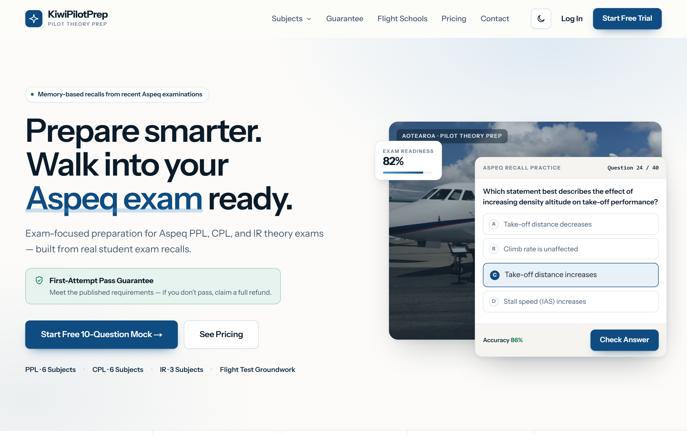
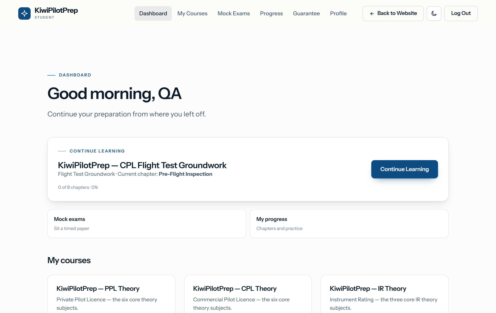
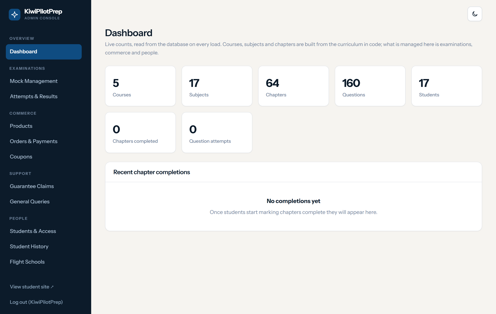
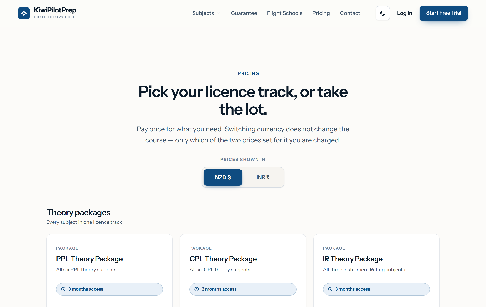
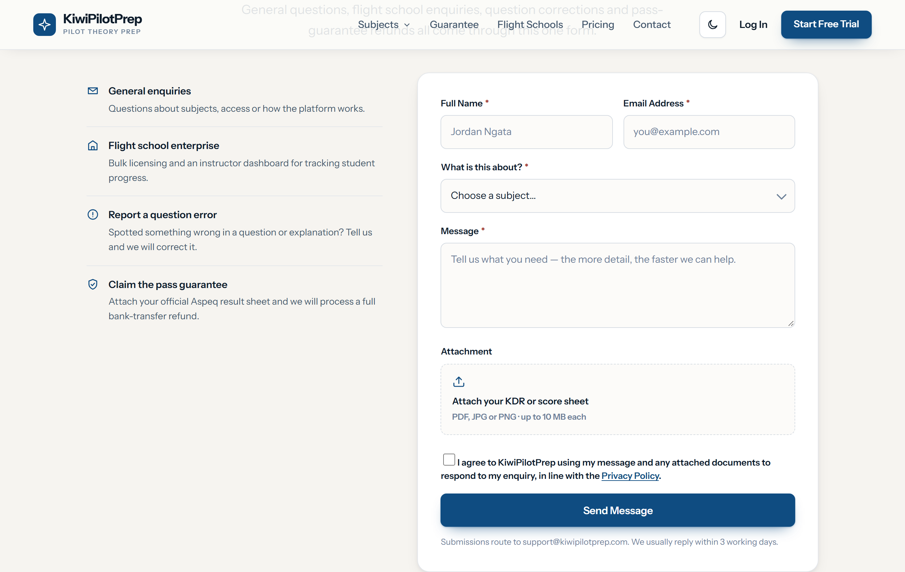
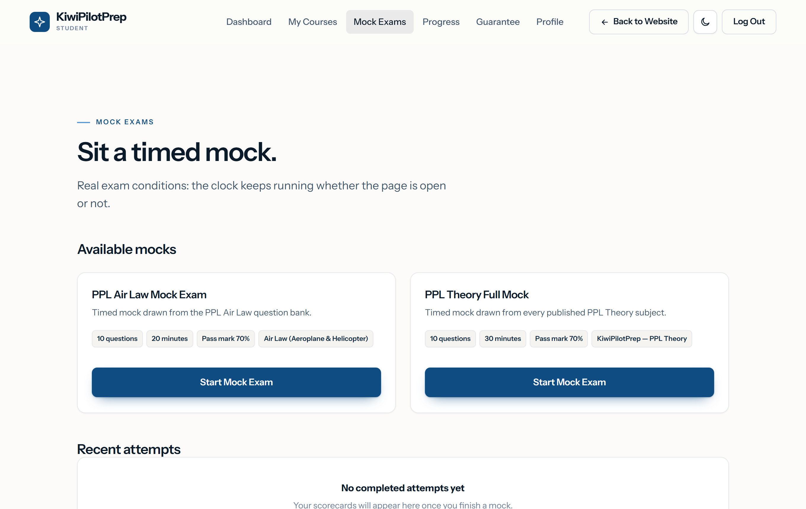
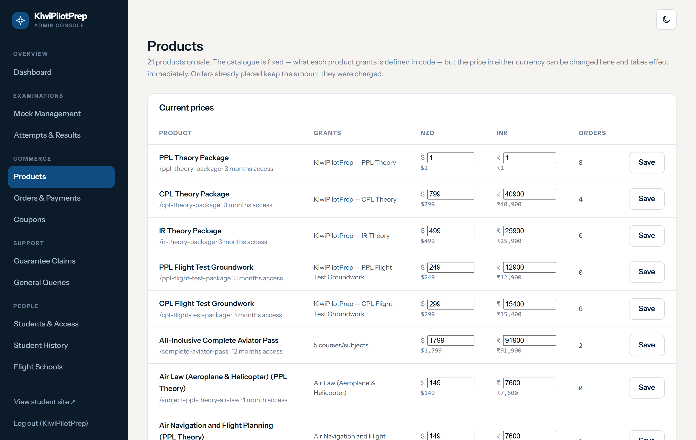
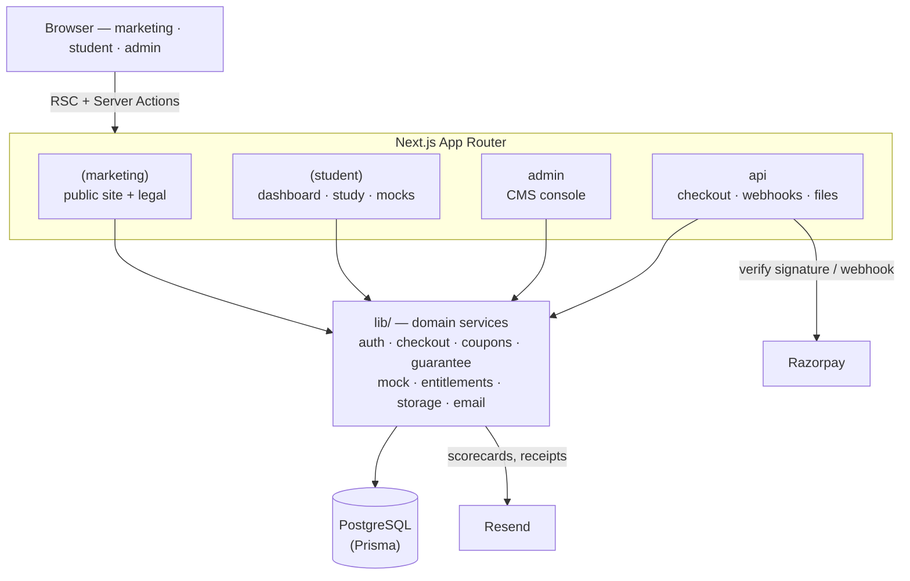

<div align="center">

# ✈️ KiwiPilotPrep

**Exam-focused preparation for Aspeq PPL, CPL & IR theory exams — a public marketing site, a student learning platform, and an admin CMS in one Next.js application.**

Built from real student exam recalls. By a student pilot, for student pilots.




</div>

---

## What it is

KiwiPilotPrep is a full-stack aviation-theory LMS. One codebase serves three audiences:

- **Prospective students** — a marketing site with pricing, a free 10-question mock, and a first-attempt pass guarantee.
- **Students** — a learning platform with syllabus-indexed study material, chapter-wise practice questions, timed mock exams, an automated **Knowledge Deficiency Report (KDR)** emailed after each attempt, and a readiness picture.
- **Administrators** — a CMS for examinations, products, orders, coupons, guarantee claims, refunds, and student access.

Everything that decides money or access — prices, discounts, entitlements, payment verification, guarantee eligibility — is computed **server-side** and never trusted from the browser.

---

## Screenshots

| Student dashboard | Admin console |
|---|---|
|  |  |

| Pricing (NZD / INR, coupons) | Contact & guarantee claims |
|---|---|
|  |  |

| Mock exams | Admin — products |
|---|---|
|  |  |

---

## Features

### Learning platform
- Syllabus-indexed study material (PPL, CPL, IR — 15 theory subjects + flight-test groundwork)
- Chapter-wise inline practice questions with explanations
- Timed mock exam engine with a real exam clock
- Automated KDR scorecard emailed after every attempt (PDF)
- Per-student progress and readiness tracking

### Commerce
- Single pricing page: NZD / INR toggle backed by configured database prices (never a front-end conversion)
- Per-card discount codes, validated and re-priced **server-side** before payment
- Direct-to-checkout with the product, currency, and coupon preserved through login
- **Razorpay** payment integration with server-side signature verification and a webhook
- Entitlement-based course access; a first-attempt **pass guarantee** with a full claim → review → refund workflow

### Admin CMS
- Live dashboard, mock/question management, attempts & results
- Products, orders & payments, discount coupons
- Guarantee-claim review with an audited state machine and refunds
- Students & access, student history, and a Flight School enterprise portal

### Cross-cutting
- Light / dark theme, fully responsive (desktop / tablet / mobile)
- Accessibility pass — labelled forms, keyboard-friendly, colour-contrast checked
- NZ Privacy Act + India **DPDP** aware: privacy, terms, refunds and cookie policies, cookie notice, and form consent

---

## Tech stack

| Layer | Choice |
|---|---|
| Framework | **Next.js 16** — App Router, Turbopack, React Server Components + Server Actions |
| UI | **React 19**, hand-written CSS design system (light/dark tokens) |
| Language | **TypeScript** (strict) |
| Database | **PostgreSQL 16** via **Prisma 6** |
| Auth | Signed JWT sessions (`jose`), `bcryptjs` password hashing |
| Payments | **Razorpay** (server-verified signatures + webhook) |
| Email | **Resend** |
| PDF | `pdfkit` (KDR scorecards & reports) |
| Validation | `zod` |
| Testing | **Vitest** (unit) · **Playwright** + custom Node suites (integration / E2E) |

---

## Architecture



Route groups isolate the three audiences; each has its own layout and access gate. All shared domain logic lives in `lib/` and is the only thing that talks to the database.

### Project structure

```
app/
  (marketing)/   public site, pricing, checkout entry, legal pages
  (student)/     dashboard, study reader, mock engine, guarantee
  (org)/         flight-school enterprise portal
  (purchase)/    checkout resolver (survives login/verify detours)
  admin/         admin CMS console
  api/           checkout, webhooks, file-serving routes
components/       UI — site, student, admin, checkout
lib/             domain services (auth, checkout, coupons, guarantee, mock, …)
prisma/          schema + migrations
tests/           unit (Vitest) + integration/E2E suites
docs/            deployment, operations, and reports
```

---

## Getting started

### Prerequisites
- Node.js 20+
- PostgreSQL 14+ (16 recommended)

### 1. Install
```bash
npm install
```

### 2. Environment
Copy the template and fill it in (it documents every variable):
```bash
cp .env.example .env
```
Key variables: `DATABASE_URL`, `AUTH_SECRET`, `NEXT_PUBLIC_SITE_URL`, and — for payments and email — `RAZORPAY_KEY_ID` / `RAZORPAY_KEY_SECRET` / `RAZORPAY_WEBHOOK_SECRET`, `RESEND_API_KEY` / `EMAIL_FROM`.

### 3. Database
```bash
npm run db:migrate:deploy   # apply migrations
npm run seed                # seed baseline data
```

### 4. Run
```bash
npm run dev                 # http://localhost:3000
```

> Migrations are additive and are applied with `db:migrate:deploy`. `prisma migrate dev` is guarded to refuse running under `NODE_ENV=production`.

### 5. Temporary demo on GitHub Codespaces

For a shareable link without provisioning anything, open the repository in a
codespace (**Code -> Codespaces -> Create codespace on main**). `.devcontainer/`
brings up a throwaway Postgres, migrates, seeds, builds, and serves the app on
port 3100 at `https://<codespace-name>-3100.app.github.dev`.

Sign in as `admin@kiwipilotprep.com` / `admin12345`, or
`student@example.com` / `student12345`.

This is a **demo, not a deployment**: payments run through the built-in sandbox
gateway, email is written to the server log instead of being sent, and study
material is the seeded placeholder content — the extracted decks live in
`.cache/` and are not in the repository. The forwarded port starts private to
the codespace owner; `start.sh` tries to make it public, and the PORTS panel
does it manually if that fails. A codespace stops when idle, and the link stops
with it.

GitHub **Pages** cannot host this app at all: it serves static files only, while
every page here needs a database and a server.

---

## Testing

A deep automated suite — **329 unit tests** (Vitest) plus **20 integration / end-to-end suites** (~1,500 assertions) covering the full purchase and exam flows, payments, guarantee claims, accessibility, and security.

```bash
npm test                 # everything
npm run test:unit        # Vitest unit tests
npm run test:security    # adversarial security suite
npm run test:pricing     # pricing & checkout flow
npm run test:responsive  # responsive / a11y (Playwright)
```

Highlights: `pricing-flow`, `payments`, `razorpay`, `coupons`, `guarantee`, `claims`, `idor`, **`security`**, `auth`, `verification`, `mocks`, `responsive`.

---

## Security

The app ships with a permanent **adversarial security suite** (`tests/security.mjs`) run on every test pass. It verifies, among others:

- **Access control** — anonymous and cross-role access refused; **IDOR** on orders, documents, attachments and study figures returns `404` (existence not disclosed)
- **Auth** — signed-JWT sessions (HttpOnly · SameSite · Secure-in-prod), forged and `alg:none` tokens rejected, no user enumeration, login rate-limiting
- **Payments** — price/coupon tampering ignored (server prices from the DB), forged Razorpay signatures grant nothing, sandbox disabled in production
- **Web** — no open redirect, no reflected XSS, no secrets in the client bundle, CSRF-safe Server Actions, strict CSP + `X-Frame-Options: DENY` + `nosniff`

Last audit: **0 vulnerabilities** across 30 checks. See [`docs/OPERATIONS.md`](docs/OPERATIONS.md) for the production security checklist.

---

## Documentation

- [`docs/DEPLOYMENT.md`](docs/DEPLOYMENT.md) — production setup, backups, recovery
- [`docs/OPERATIONS.md`](docs/OPERATIONS.md) — runbook: env, migrations, health, restore drill
- [`docs/RAZORPAY-TEST-MODE.md`](docs/RAZORPAY-TEST-MODE.md) — payment testing
- [`docs/PHASE-6-REPORT.md`](docs/PHASE-6-REPORT.md) — production-readiness assessment

---

## Disclaimer

KiwiPilotPrep is an independent educational tool. It is **not affiliated with, endorsed by, or acting on behalf of Aspeq or CAANZ**, and does not deliver official examinations — all examinations are sat through the official examination provider. Guarantee eligibility criteria and refund conditions apply.
